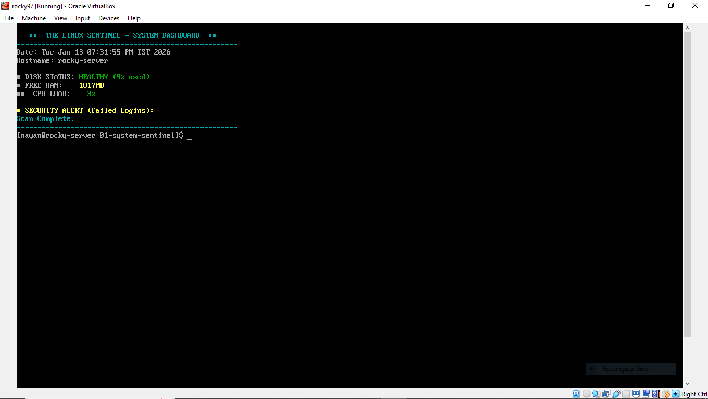

# 🛡️ The Linux Sentinel - System Dashboard

## 📋 Project Overview
This is a *Bash Automation Tool* that replaces manual system checks. Instead of running free, df, and top separately, "The Sentinel" generates an *instant, color-coded health report*.

## 🚀 Key Features
* *Live Health Check:* Monitors Disk (Red alert if >80%), RAM, and CPU.
* *Intrusion Detection:* Scans /var/log/secure for failed password attempts.
* *Visual Dashboard:* Uses ANSI escape codes for a professional UI.

## 📸 Proof of Execution
Script running on Rocky Linux 9 (VirtualBox):



## 💻 Code Snippet (Logic)
```bash
# Color-Coded Disk Warning
if [ $DISK_USAGE -ge 80 ]; then
    echo -e "💾 DISK STATUS: ${RED}CRITICAL ($DISK_USAGE%)${RESET}"
else
    echo -e "💾 DISK STATUS: ${GREEN}HEALTHY ($DISK_USAGE%)${RESET}"
fi
